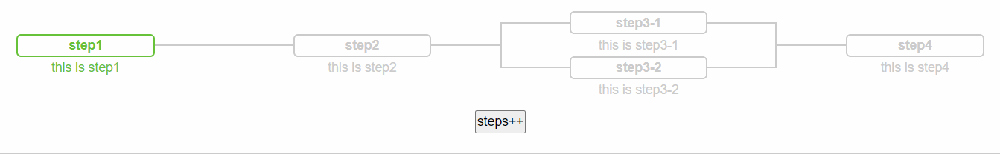
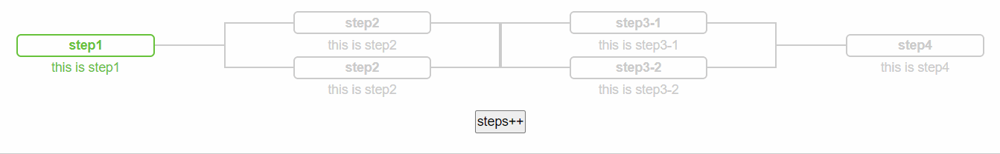
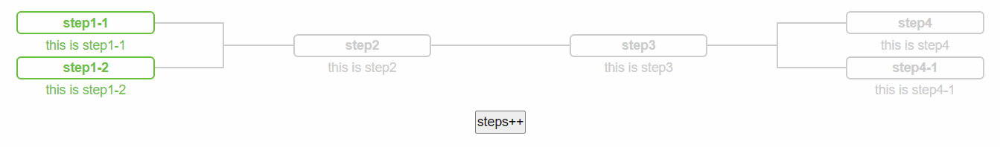
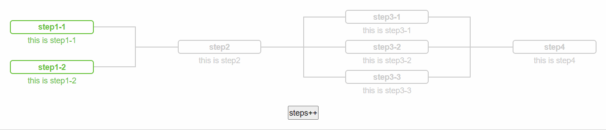
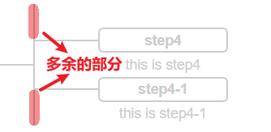
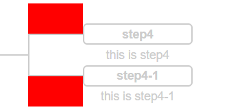

#### <center>效果图</center>



####

#### <center>缺点</center>

- 只适用于相邻两个阶段之间，只能`有一个 " 两个及以上 "`的流程，先看图说话。

  

  ####

  step2 里有两个步骤，step3 也有两个步骤，就会导致如上图所示的情况（这也是这个组件暂时没考虑的地方，等后续再优化一下），除了这种情况，其他的展示效果还是蛮好的。

  

  ####

  

  ####

- 边框线条宽度这块，有时候虽然设置的是一样的值，但是显示时，不是这个高点，就是那个宽点，为了展示出来美观些，我也是做了一些改动。

#### <center>代码</center>

##### <p>template</p>

```js
<template>
  <div
    class="fc-wrap"
    :style="{
      '--fc-default-color': color,
      '--fc-active-color': activeColor,
      '--fc-background-color': backgroundColor,
      height: (height ? height : autoHeight) + 'px',
    }"
  >
    <div
      :class="[
        'fc-item',
        i <= activeSteps ? 'fc-item--active ' + activeStyle : '',
        i < activeSteps ? 'fc-item--active-before' : '',
        i === 0 ? 'fc-item--head' : '',
        i === contentList.length - 1 ? 'fc-item--tail' : '',
        v.length > 1 ? 'fc-item--multipart' : '',
      ]"
      :style="'flex: ' + 1"
      v-for="(v, i) in contentList"
      :key="i"
    >
      <div class="fc-part" v-for="(t, n) in v" :key="n">
        <div class="fc-part-inner">
          <div class="title">{{ t.title }}</div>
          <div :class="'description--' + descriptionLocation">{{ t.description }}</div>
        </div>
      </div>
    </div>
  </div>
</template>
```

##### <p>script</p>

```js
<script>
export default {
  props: {
    contentList: {
      /* 流程列表，传参类型
        [
          [
            { title: 'step1-1', description: 'this is step1-1' },
            { title: 'step1-2', description: 'this is step1-2' },
          ],
          [
            { title: 'step2', description: 'this is step2' },
          ],
          [
            { title: 'step3', description: 'this is step3' },
          ],
          [
            { title: 'step4', description: 'this is step4' },
            { title: 'step4-1', description: 'this is step4-1' }
          ]
        ]
      */
      type: Array,
      required: true,
      default: () => [],
      validator (val) {
        return val.every(step => {
          return step.every(item => {
            let keys = Object.keys(item)
            return keys.includes('title') && keys.includes('description')
          })
        })
      }
    },
    /* 当前进度 */
    activeSteps: {
      type: Number,
      required: true,
      default: 0
    },
    activeStyle: {
      type: String,
      default: 'left',
      validator (val) {
        return ['left', 'center', 'right'].includes(val)
      }
    },
    descriptionLocation: {
      type: String,
      default: 'in',
      validator (val) {
        return ['in', 'out'].includes(val)
      }
    },
    color: {
      type: String,
      default: '#ccc'
    },
    activeColor: {
      type: String,
      default: '#67c23a'
    },
    backgroundColor: {
      type: String,
      default: '#fff'
    },
    height: {
      type: String,
      default: ''
    }
  },
  data () {
    return {
      autoHeight: 0
    }
  },
  methods: {
    /* 根据子流程最大步骤数量自适应高度 */
    initHeight () {
      this.contentList.forEach(item => {
        this.autoHeight = Math.max(this.autoHeight, item.length)
      })
      this.autoHeight *= 70
    }
  },
  mounted () {
    this.initHeight()
  }
}
</script>
```

##### <p>style</p>

```scss
<style lang="scss" scoped>
$line-width: 1.5px;
$border-width: 2px;
.fc-wrap {
  width: 100%;
  height: 300px;
  padding: 10px;
  display: flex;

  .fc-item {
    flex: 1;
    display: flex;
    align-items: center;
    justify-content: center;
    overflow: hidden;

    .fc-part {
      width: 100%;
      position: relative;
      transition: 0.5s;

      &::before {
        left: 0;
      }
      &::after {
        right: 0;
      }

      &::before,
      &::after {
        flex: 1;
        content: '';
        width: 25%;
        height: $line-width;
        position: absolute;
        top: calc(50% - 1px);
        background: var(--fc-default-color);
        transition: 0.5s;
      }
    }

    .fc-part-inner {
      transition: 0.5s;
    }
  }
}

.fc-wrap .fc-item--head .fc-part::before,
.fc-wrap .fc-item--tail .fc-part::after {
  display: none;
}

.fc-wrap .fc-part-inner {
  width: 50%;
  margin-left: 25%;
  position: relative;
  display: flex;
  flex-direction: column;
  justify-content: center;
  align-items: center;
  border: $border-width solid var(--fc-default-color);
  border-radius: 5px;
  color: var(--fc-default-color);

  .title {
    font-weight: bold;
  }

  .description--out {
    position: absolute;
    bottom: -1.5rem;
  }
}

/* 多个环节时 */
.fc-wrap .fc-item--multipart {
  display: flex;
  flex-direction: column;
  justify-content: space-evenly;
  position: relative;

  &.fc-item--head::before,
  &.fc-item--tail::after {
    display: none;
  }

  &::before,
  &::after {
    content: '';
    position: absolute;
    width: $line-width;
    height: 100%;
    background: var(--fc-default-color);
    transition: 0.5s;
  }

  &::before {
    left: 0;
  }

  &::after {
    right: 0;
  }

  .fc-part:first-child {
    &::before,
    &::after {
      top: auto;
      bottom: calc(50% - 1px);
      height: 0;
      border-top: 999px solid var(--fc-background-color);
      border-bottom: 1px solid var(--fc-default-color);
      box-sizing: content-box;
      z-index: 999;
    }
  }

  .fc-part:last-child::before,
  .fc-part:last-child::after {
    height: 0;
    border-top: 1px solid var(--fc-default-color);
    border-bottom: 999px solid var(--fc-background-color);
    box-sizing: content-box;
    z-index: 999;
  }
}

/* active */
.fc-wrap .fc-item--active-before {
  .fc-part::before,
  .fc-part::after,
  &.fc-item--multipart::before,
  &.fc-item--multipart::after {
    background: var(--fc-active-color);
  }

  &.fc-item--multipart {
    .fc-part:first-child::before,
    .fc-part:first-child::after {
      border-bottom-color: var(--fc-active-color);
    }

    .fc-part:last-child::before,
    .fc-part:last-child::after {
      border-top-color: var(--fc-active-color);
    }
  }
}

.fc-wrap .fc-item--active {
  &.left {
    .fc-part::before,
    &.fc-item--multipart::before {
      background: var(--fc-active-color);
    }

    &.fc-item--multipart {
      .fc-part:first-child::before {
        border-bottom-color: var(--fc-active-color);
      }

      .fc-part:last-child::before {
        border-top-color: var(--fc-active-color);
      }
    }
  }

  &.center,
  &.right {
    .fc-part::before,
    .fc-part::after,
    &.fc-item--multipart::before,
    &.fc-item--multipart::after {
      background: var(--fc-active-color) !important;
    }

    &.fc-item--multipart {
      .fc-part:first-child::before,
      .fc-part:first-child::after {
        border-bottom-color: var(--fc-active-color);
      }

      .fc-part:last-child::before,
      .fc-part:last-child::after {
        border-top-color: var(--fc-active-color);
      }
    }
  }

  &.right + .fc-item {
    .fc-part::before,
    &.fc-item--multipart::before {
      background: var(--fc-active-color) !important;
    }

    &.fc-item--multipart {
      .fc-part:first-child::before {
        border-bottom-color: var(--fc-active-color);
      }

      .fc-part:last-child::before {
        border-top-color: var(--fc-active-color);
      }
    }
  }

  .fc-part-inner {
    color: var(--fc-active-color);
    border-color: var(--fc-active-color);
  }
}
</style>
```

#### <center>实现思路</center>

样式的实现，几乎都是通过动态设置不同的`Class`来对样式进行操作和变换，也算是对自己`CSS`功底的考验。唯一用到`js`的部分就是，获取当前流程中子流程最多的步骤数，然后自适应流程图的高度。
讲讲这个组件功能实现中，自我感觉最巧妙的部分：`当子流程有多个步骤时，如何绘制将子流程连接起来的线条？`

- 每个流程前后的线段是用它们各自的`::before`、`::after`伪类实现；
- 而连接子流程的线段同样也是用最外层父元素的`::before`、`::after`伪类实现；
- 关键点在于，父元素的伪类高度如何刚好与最上面的步骤和最下面的步骤刚好连接在一起？
- 最开始是想通过`js`实现，但会很麻烦，仔细想想过后，其实只要把多余的部分掩盖掉，就能在视觉上呈现出两条线段连接在一起的效果；

  

  ####

- 然后我调整了子流程中，首尾两个步骤的伪类样式：

  - 头部步骤：

    - `::before`、`::after`:

      ```css
      height: 0;
      border-top: 无限大（这里我给的是 999px) solid 背景色;
      border-bottom: 1px solid 线条颜色;
      ```

  - 尾部步骤：

    - `::before`、`::after`:

      ```css
        height: 0;
        border-top: 1px solid 线条颜色
        border-bottom: 999px solid 背景色
      ```

  - 效果如图（若背景色为红色），设置`height`+`border-top/bottom`同样也能实现。

    

    ####

  - 最后，给父元素设置`overflow: hidden`，PERFECT！
